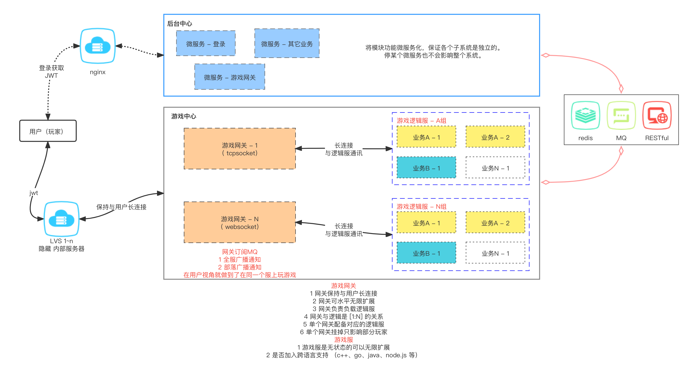
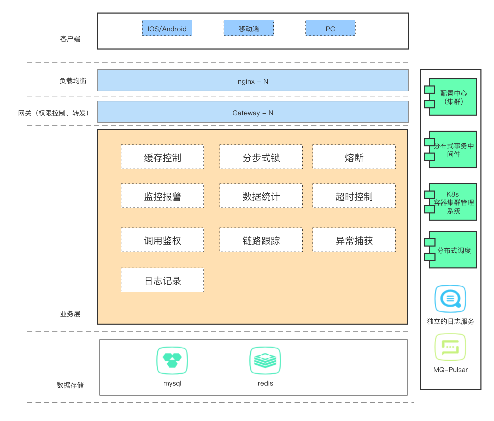
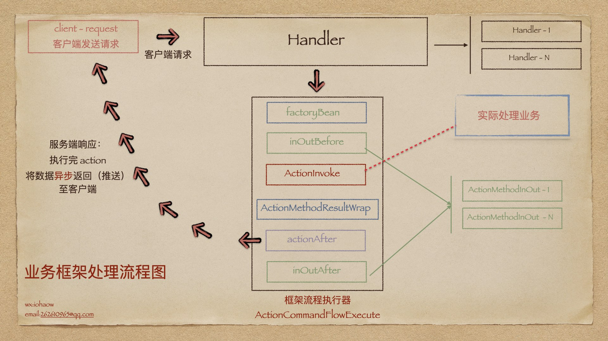
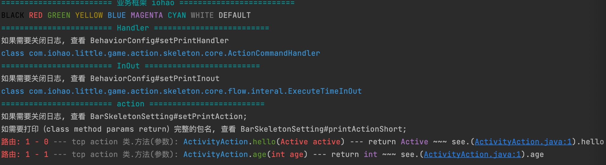
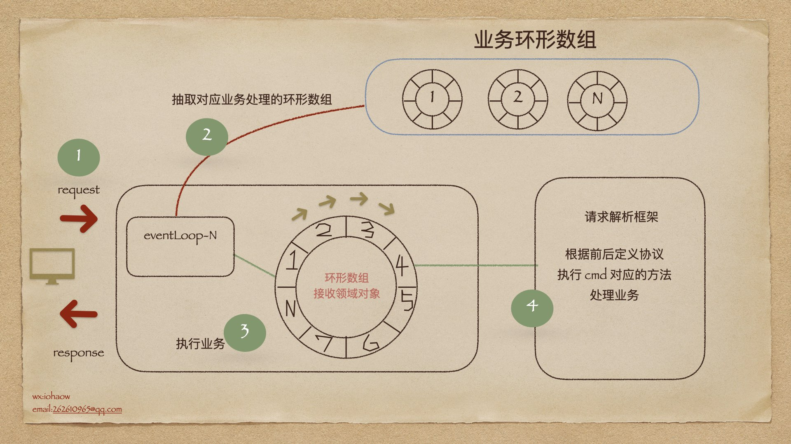
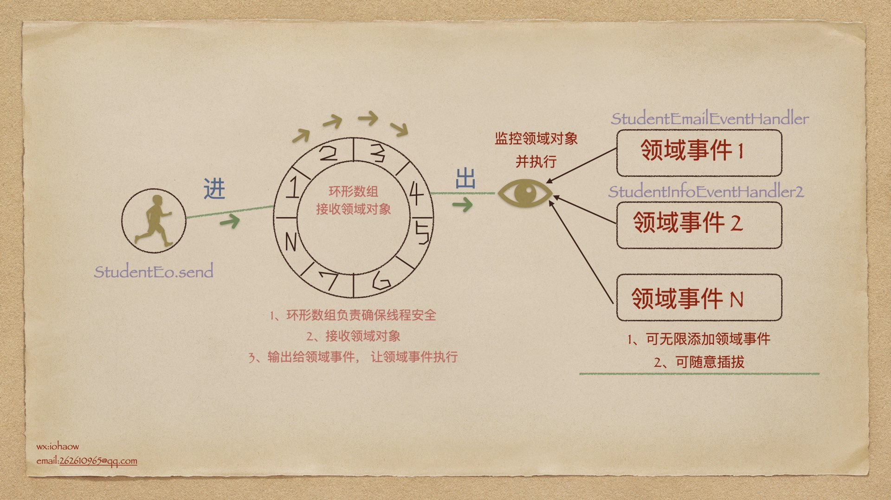

### 游戏技术框架

[]()

基于 [sofa-bolt](https://www.sofastack.tech/projects/sofa-bolt/overview/) 的游戏框架

```text
可用于页游，手游，游戏服务器端；
对业务处理是基于disruptor环形数组来消费业务；
断线重连 心跳检测 
目前是一个空架子,没有业务, 调通了通讯部分
完成子逻辑服之间的通讯 （如： 子模块A 访问 子模块B 的某个方法，因为只有子模块B持有这些数据）
```

#### 正在开发的 (计划中)

```text
网关启动， 子服务器自动连接

广播 - 完成
    子服务器广播
    抽象广播方法，内部使用 redis 或 mq 实现
    
小部件
    逻辑服广播到网关服务器 - (完成)
    分步式锁 - (开发中)
    缓存层 - (开发中)

网关扩展增强
    熔断
    限流
    降载

其他
    自动缓存控制
    链路跟踪
    统计报警
    监控报警
    请求参数与响应可视化 （防止前后端因为参数传递与否的问题，而扯皮造成的时间浪费）

统计扩展
    用户流量统计
    用户方法掉用次数统计
    
```

#### 框架解决的相关问题

```text
    请求参数与响应可视化 （防止前后端因为参数传递与否的问题，而扯皮造成的时间浪费）
```

```text
已完成
    内建服务发现、负载均衡
    
```

#### 项目结构

启动类 示例

```text
每个项目的 **Application 是主启动类, 启动类平级包 commandline 是项目的启动项.

启动示例:
1 启动网关 GatewayApplication
2 启动游戏服-ClientAll

1 2 步骤启动完毕后, 在 GatewayApplication 中提供了一些模拟请求
这些模拟请求通过 http 的方式触发 (模拟客户端请求网关， 网关转发数据到子服务器)
 
```

### 简介

项目使用[通讯框架]和[业务框架]来处理；

通讯框架(SOFABolt)：负责端端之间的传输数据

业务框架：负责业务的处理方式和编写方式

### 架构图

#### 整体服务器通讯



#### 层级图



### 通讯框架 - SOFABolt

SOFABolt 是蚂蚁金融服务集团开发的一套基于 Netty 实现的网络通信框架。

- 为了让 Java 程序员能将更多的精力放在基于网络通信的业务逻辑实现上，而不是过多的纠结于网络底层 NIO 的实现以及处理难以调试的网络问题，Netty 应运而生。
- 为了让中间件开发者能将更多的精力放在产品功能特性实现上，而不是重复地一遍遍制造通信框架的轮子，SOFABolt 应运而生。

Bolt 名字取自迪士尼动画-闪电狗，是一个基于 Netty 最佳实践的轻量、易用、高性能、易扩展的通信框架。

### 业务框架 - iohao-bar

- 特点：跨NIO框架, 可以做到业务代码不做任何改动就能轻松实现NIO框架的切换.(netty mina 这些都属于NIO框架)
- 屏蔽 NIO 框架
- 请求响应监控 方便日志定位
- 插件机制
- 可生成对于客户端的api文档 （代码即是文档）
- 同时对于任意MVC框架有了解的都可以很快上手.

#### 业务框架处理流程图
> 业务框架可以使得网络编程变得很简单
>

```text
see ActionCommandFlowExecute
```

####  业务类示例 （**Action**)
> **业务类通常由用户编写**
>
> 这个示例展示了程序员的编程日常, 使用很简洁.
> 
> 下面示例展示了对外(游戏前端) 开放了两个接口
>
> 几乎就是一个普通的java类. 就能够完成对tcp的编程.(**一个方法就是一个action**)
> 
> 同时对于任意MVC框架有了解的都可以很快上手.
>
> 无需了解nio框架, 甚至无需了解业务框架. 直接编写业务. 一个方法处理一件事情.

```text
Action 就是用户编写的业务处理类
比如：
通过用户id获取用户信息
查看当前玩家多少级 
等等..

下面举一个实际例子
```

```java

@ActionController(ActivityModule.cmd)
public class ActivityAction {
    /**
     * <pre>
     *     打招呼 hello
     *     实现注解 ActionMethod 告知业务框架这是一个对外开放的action (既一个方法就是一个对外的处理)
     *     这里请求参数是一个对象，响应是一个对象的示例
     * </pre>
     *
     * @param active 请求参数，是由掉用方传入 (通常是游戏的客户端)
     * @return 响应 （对象）
     */
    @ActionMethod(ActivityModule.hello)
    public String hello(Active active) {
        return active.getName() + ", I'm here ";
    }

    /**
     * <pre>
     *     age process
     * </pre>
     *
     * @param age age
     * @return age + 10
     */
    @ActionMethod(ActivityModule.age)
    public int age(int age) {
        // 从这里可以看出，参数与返回值可以是任意类型
        return age + 10;
    }
}
```

路由常量的定义 （不是必需的）

```java
public interface ActivityModule {
    /** 模块A - 主 cmd */
    int cmd = 1;
    /** subCmd : hello method */
    int hello = 0;
    /** subCmd : age method */
    int age = 1;
}
```

#### 日志输出

> 模拟前端（游戏前端）发送的请求

```java
public class ActivityActionTest {
    @Test
    public void hello() {
        // 模拟路由信息
        CmdInfo cmdInfo = CmdInfoFlyweightFactory.me().getCmdInfo(ActivityModule.cmd, ActivityModule.hello);

        // 模拟前端请求
        RequestMessage requestMessage = new RequestMessage();
        requestMessage.setCmdInfo(cmdInfo);

        // 模拟请求数据 （一般由前端传入）
        Active active = new Active();
        active.setName("塔姆");
        active.setId(101);

        // 把模拟请求的数据,放入请求对象中
        requestMessage.setData(active);

        // 上面都是由前端传入， 实际的代码从这里开始
        // 业务框架处理用户请求
        barSkeleton.handle(new DefaultParamContext(), requestMessage);
    }
}
```

> 当访问业务方法时，会看到日志输出如下

```text
┏━━━━━ Debug [ActivityAction.java] ━━━ [.(ActivityAction.java:1).hello]
┣ 参数: active : Active(id=101, name=塔姆)
┣ 响应: 塔姆, I'm here 
┣ 时间: 1 ms (业务方法总耗时)
┗━━━━━ Debug [ActivityAction.java] ━━━
```

#### 启动信息

业务框架启动时会打印出

- 对外提供的方法
- 插件
- 对外提供的方法信息包括（路由、类名、方法名、方法参数、返回值等）



#### 领域事件 - 环形数组来消费业务

- [领域事件文档](https://gitee.com/iohao/com-iohao-widget/tree/master/iohao-domain) 领域事件文档




### 其它

#### 技术框架列表

- [spring-boot 2.6.x](https://www.oschina.net/p/spring-boot)
- [netty 4.x](https://www.oschina.net/p/netty) 高性能网络应用框架
- [commons-pool2](https://www.oschina.net/p/commons-pool) 对象池
- [Lettuce](https://www.oschina.net/p/lettuce) Lettuce是一个异步高性能,可伸缩线程安全的Redis客户端
- [LMAX架构 disruptor](https://www.oschina.net/p/disruptor) 环形数组内核
- [Reactor3](https://www.oschina.net/p/reactor) 异步应用基础库
- [nacos 配置中心](https://www.oschina.net/p/nacos)
- [pb](https://www.oschina.net/p/protocol+buffers) 数据描述语言。数据存储、通信协议等方面
- [fastjson](https://www.oschina.net/p/fastjson) JSON 解析器和生成器

#### 不熟悉 springboot 的朋友请看这里

```text
如果你发现一些没调用的类, 却被运行了, 那么这时候就是使用了 springboot 的自动装配机制.
只需要引入包就能自动装配

提供的自动装配:
see:
resources --> META-INF --> spring.factories
(查看被引用的包下的 此文件夹就能找到自动装配配置)

```

#### JDK17 新特性详解

1. [JDK 新特性详解](https://my.oschina.net/mdxlcj/blog/3107021)

```text
停顿时间在 10ms 以下，10ms 其实是一个很保守的数据，即便是 10ms 这个数据，也是 GC 调优几乎达不到的极值。
根据 SPECjbb 2015 的基准测试，128G 的大堆下最大停顿时间才 1.68ms，远低于 10ms，和 G1 算法相比，改进非常明显。
```

#### 辅助,规范,部署,构建

- [docker](https://www.oschina.net/p/docker) 应用容器引擎
- [Kubernetes](https://www.oschina.net/p/kubernetes) 容器集群管理系统
- [Linux](https://www.oschina.net/p/linux) 最终部署操作系统
- [遵循阿里巴巴Java开发手册](https://github.com/alibaba/p3c "遵循阿里巴巴Java开发手册")
- [阿里规约在线文档](https://kangroo.gitee.io/ajcg/#/ "规约在线文档")
- [Lombok](https://www.oschina.net/p/lombok) 消除冗长的 Java 代码
- [maven](https://www.oschina.net/p/maven) 项目构建工具